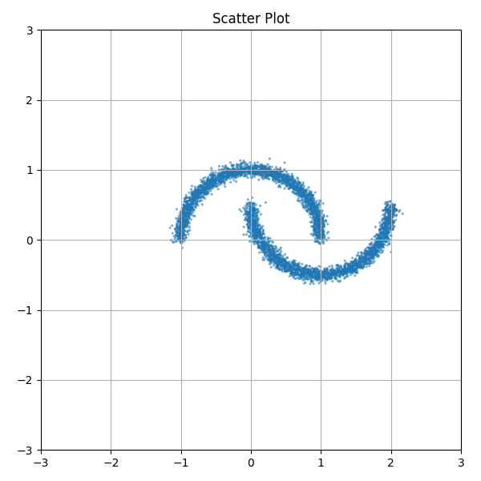
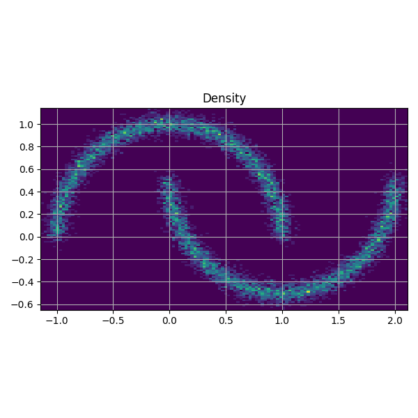
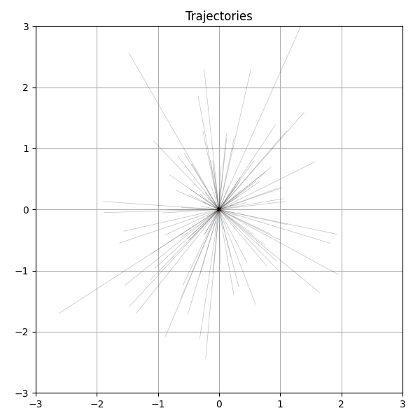
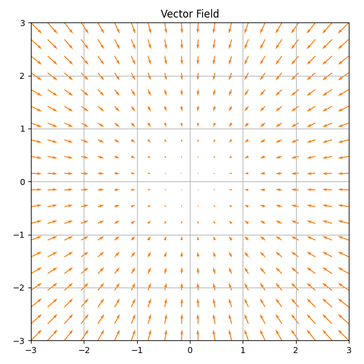

# Generative Dynamics Visualizer

Visualizador para comparar las dinámicas de modelos generativos continuos sobre distribuciones bidimensionales mediante animaciones de Diffusion Models y Flow Matching.

## Características

- Diffusion Models (VP, VE, sub-VP)
- Flow Matching
- Reverse-time SDE
- Probability Flow ODE
- Integradores Euler, Euler-Maruyama y Heun
- Exportación a MP4, GIF y PNG

---

## Instalación

```bash
git clone https://github.com/andrewkc/generative-dynamics-visualizer.git
cd generative-dynamics-visualizer

conda create -n genviz python=3.10
conda activate genviz
pip install -r requirements.txt
```

---

## Entrenamiento

```bash
python train.py --config configs/vp.yaml
```

---

## Generación

```bash
python generate.py --checkpoint checkpoints/model.pt
```

---

## Animaciones

```bash
python animate.py --animation forward
```

---

# Resultados

## Comparación de procesos Forward

<p align="center">

</p>

---

## Scatter Plot

<p align="center">

</p>

---

## Density

<p align="center">

</p>

---

## Particle Trajectories

<p align="center">

</p>

---

## Score Vector Field

<p align="center">

</p>

---

## Distribuciones soportadas

- Two Moons
- Eight Gaussians
- Checkerboard
- Spirals
- Rings
- Pinwheel